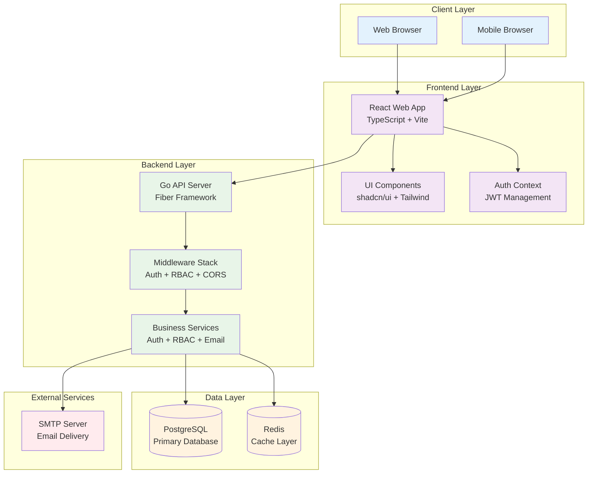

# Studio45

A modern, full-stack application built with Go and React, featuring comprehensive role-based access control (RBAC), user management, and email template systems. Studio45 provides a secure, scalable platform for building enterprise-grade applications with advanced authentication and authorization capabilities.

## Table of Contents

- [Studio45](#studio45)
  - [Table of Contents](#table-of-contents)
  - [Features](#features)
  - [Architecture Overview](#architecture-overview)
  - [Quick Start](#quick-start)
  - [Documentation](#documentation)
  - [Support](#support)

## Features

### Backend Features
- **Authentication & Authorization**: JWT-based authentication with comprehensive RBAC
- **User Management**: Complete user lifecycle with profile management and admin controls
- **Role-Based Access Control**: Normalized RBAC system with granular permissions
- **Email Template Management**: Database-driven customizable email templates with preview and testing
- **Password Reset**: Secure email-based password recovery with configurable templates
- **Database Migrations**: Version-controlled schema management with rollback support
- **Security**: Input validation, SQL injection prevention, and rate limiting

### Frontend Features
- **Modern React**: React 19 with TypeScript and modern development practices
- **Beautiful UI**: shadcn/ui components with Tailwind CSS styling
- **Responsive Design**: Mobile-first design that works on all devices
- **Protected Routes**: Role-based route protection with authentication guards
- **Admin Dashboard**: Full-featured admin interface with data visualization
- **Theme Support**: Dark/light theme with system preference detection

### System Features
- **Monorepo Architecture**: Organized codebase with clear separation of concerns
- **Docker Support**: Containerized deployment with Docker Compose
- **Performance**: Optimized builds with Vite and efficient database queries
- **Type Safety**: Full TypeScript coverage with strict mode enabled

## Architecture Overview

Studio45 follows a modern, layered architecture pattern with clear separation between frontend, backend, and data layers:



### Technology Stack

**Frontend:**
- React 19 with TypeScript
- Vite for build tooling
- shadcn/ui + Tailwind CSS
- React Hook Form + Zod validation

**Backend:**
- Go 1.24 with Fiber framework
- GORM for database operations
- JWT for authentication
- Go Migrate for schema management

**Database:**
- PostgreSQL (primary database)
- Redis (caching layer)

**Development:**
- Docker & Docker Compose
- ESLint + TypeScript compiler
- Git for version control

## Quick Start

### Prerequisites

- **Go 1.24+**: [Download Go](https://golang.org/dl/)
- **Node.js 18+**: [Download Node.js](https://nodejs.org/)
- **PostgreSQL 13+**: [Download PostgreSQL](https://www.postgresql.org/download/)
- **Docker** (optional): [Download Docker](https://www.docker.com/get-started)

### Installation

1. **Clone the repository:**
   ```bash
   git clone https://github.com/ak9024/studio45.git
   cd studio45
   ```

2. **Set up the database:**
   ```bash
   createdb studio45_dev
   ```

3. **Start the backend:**
   ```bash
   cd apps/api
   cp .env.example .env
   # Edit .env with your database configuration
   go mod download
   go run main.go migrate up
   go run main.go
   ```

4. **Start the frontend:**
   ```bash
   cd apps/web
   cp .env.example .env
   # Edit .env with your API configuration
   npm install
   npm run dev
   ```

5. **Access the application:**
   - Frontend: http://localhost:5173
   - Backend API: http://localhost:8080

### Docker Setup (Alternative)

```bash
cd apps/api
docker-compose up -d
docker-compose exec api go run main.go migrate up
```

## Documentation

### Detailed Documentation
- **[Backend API Documentation](apps/api/README.md)**: Complete Go API documentation
- **[Frontend Documentation](apps/web/README.md)**: Complete React application documentation

### Specialized Guides
- **[RBAC System Guide](apps/api/docs/RBAC_SYSTEM.md)**: Role-Based Access Control implementation
- **[Email Templates Guide](apps/api/docs/EMAIL_TEMPLATES.md)**: Email template management
- **[SMTP Configuration](apps/api/docs/SMTP_CONFIGURATION.md)**: Email server setup

### API Endpoints

**Authentication:**
- `POST /api/v1/auth/register` - User registration
- `POST /api/v1/auth/login` - User login
- `GET /api/v1/auth/profile` - Get user profile

**Admin (Requires Admin Role):**
- `GET /api/v1/admin/users` - List all users
- `GET /api/v1/admin/roles` - List all roles
- `GET /api/v1/admin/permissions` - List all permissions
- `GET /api/v1/admin/email-templates` - List email templates

## Support

### Getting Help
1. **Documentation**: Check the comprehensive docs in each app directory
2. **Issues**: Report bugs or request features in [GitHub Issues](https://github.com/ak9024/studio45/issues)
3. **Discussions**: Join discussions in [GitHub Discussions](https://github.com/ak9024/studio45/discussions)

### Common Issues
- **Database Connection**: Verify PostgreSQL is running and DATABASE_URL is correct
- **Frontend Build**: Clear node_modules and reinstall dependencies
- **Authentication**: Verify JWT_SECRET is set consistently

---

**Built with ❤️ by [@ak9024](https://github.com/ak9024)**

*Studio45 - Empowering enterprise applications with modern technology and security*