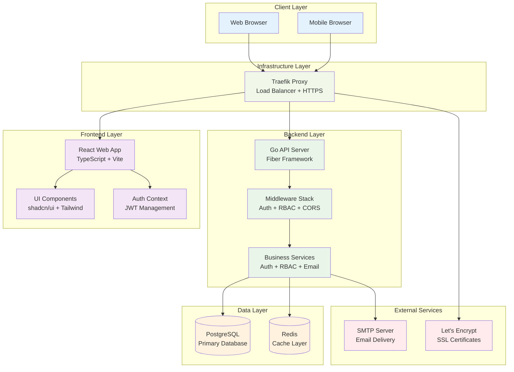
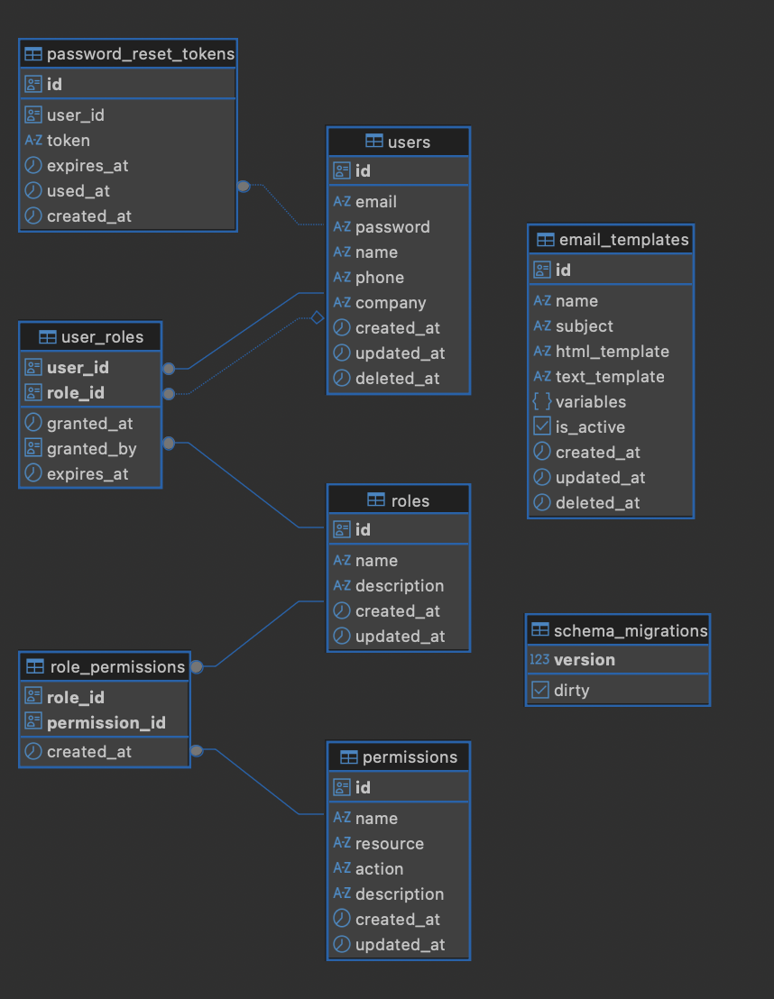

# Studio45

A modern, full-stack application built with Go and React, featuring comprehensive role-based access control (RBAC), user management, and email template systems. Studio45 provides a secure, scalable platform for building enterprise-grade applications with advanced authentication and authorization capabilities.

## Table of Contents

- [Studio45](#studio45)
  - [Table of Contents](#table-of-contents)
  - [Features](#features)
  - [Architecture Overview](#architecture-overview)
  - [Quick Start](#quick-start)
  - [Documentation](#documentation)
  - [Support](#support)

## Features

### Backend Features
- **Authentication & Authorization**: JWT-based authentication with comprehensive RBAC
- **User Management**: Complete user lifecycle with profile management and admin controls
- **Role-Based Access Control**: Normalized RBAC system with granular permissions
- **Email Template Management**: Database-driven customizable email templates with preview and testing
- **Password Reset**: Secure email-based password recovery with configurable templates
- **Database Migrations**: Version-controlled schema management with rollback support
- **Security**: Input validation, SQL injection prevention, and rate limiting

### Frontend Features
- **Modern React**: React 19 with TypeScript and modern development practices
- **Beautiful UI**: shadcn/ui components with Tailwind CSS styling
- **Responsive Design**: Mobile-first design that works on all devices
- **Protected Routes**: Role-based route protection with authentication guards
- **Admin Dashboard**: Full-featured admin interface with data visualization
- **Theme Support**: Dark/light theme with system preference detection

### System Features
- **Monorepo Architecture**: Organized codebase with clear separation of concerns
- **Docker Support**: Containerized deployment with Docker Compose
- **Performance**: Optimized builds with Vite and efficient database queries
- **Type Safety**: Full TypeScript coverage with strict mode enabled

## Architecture Overview

Studio45 follows a modern, layered architecture pattern with clear separation between frontend, backend, and data layers:



### Database Overview



### Technology Stack

**Frontend:**
- React 19 with TypeScript
- Vite for build tooling
- shadcn/ui + Tailwind CSS
- React Hook Form + Zod validation

**Backend:**
- Go 1.24 with Fiber framework
- GORM for database operations
- JWT for authentication
- Go Migrate for schema management

**Database:**
- PostgreSQL (primary database)
- Redis (caching layer)

**Infrastructure:**
- Docker & Docker Compose
- Traefik reverse proxy
- Let's Encrypt SSL certificates

**Development:**
- ESLint + TypeScript compiler
- Git for version control

## Quick Start

### Prerequisites

- **Go 1.24+**: [Download Go](https://golang.org/dl/)
- **Node.js 18+**: [Download Node.js](https://nodejs.org/)
- **PostgreSQL 13+**: [Download PostgreSQL](https://www.postgresql.org/download/)
- **Docker** (optional): [Download Docker](https://www.docker.com/get-started)

### Installation

1. **Clone the repository:**
   ```bash
   git clone https://github.com/ak9024/studio45.git
   cd studio45
   ```

2. **Start the backend:**
   ```bash
   cd apps/api
   cp .env.example .env
   # Edit .env with your database configuration
   go mod download
   go run main.go migrate up # automatic create database include tables
   go run main.go
   ```

3. **Start the frontend:**
   ```bash
   cd apps/web
   cp .env.example .env
   # Edit .env with your API configuration
   npm install
   npm run dev
   ```

5. **Access the application:**
   - Frontend: http://localhost:5173
   - Backend API: http://localhost:8080

### Docker Development Setup

For local development with Docker:

```bash
# Start all services (API, Web, PostgreSQL)
docker-compose -f docker-compose.local.yaml up -d

# Check service status
docker-compose -f docker-compose.local.yaml ps

# View logs
docker-compose -f docker-compose.local.yaml logs -f
```

**Access your application:**
- Frontend: http://localhost:80
- Backend API: http://localhost:8080 (internal, proxied through frontend)
- PostgreSQL: localhost:5432

**Service Management:**
```bash
# Stop all services
docker-compose -f docker-compose.local.yaml down

# Rebuild after code changes
docker-compose -f docker-compose.local.yaml up --build
```

### Docker Production Deployment

For production deployment with automatic HTTPS and reverse proxy:

**1. Configure your domain and email:**
```bash
# Edit docker-compose.yaml and update:
# - Line 38: your-email@gmail.com (Let's Encrypt notifications)
# - Line 61: CORS_ALLOWED_ORIGINS=https://yourdomain.com
# - Line 76: FRONTEND_URL=https://yourdomain.com
# - Line 121: traefik.http.routers.web.rule=Host(`yourdomain.com`)
```

**2. Set up email configuration (optional):**
```bash
# Update SMTP settings in docker-compose.yaml (lines 78-84)
# Or set EMAIL_PROVIDER=local for development
```

**3. Deploy the stack:**
```bash
# Start production services with Traefik reverse proxy
docker-compose up -d

# Monitor deployment
docker-compose logs -f

# Check service health
docker-compose ps
```

**Production Services:**
- **Traefik**: Reverse proxy with automatic HTTPS (Let's Encrypt)
- **API**: Go backend with database migrations
- **Web**: React frontend served by nginx
- **PostgreSQL**: Database with persistent storage

**SSL Certificates:**
Traefik automatically obtains and renews SSL certificates from Let's Encrypt. Certificates are stored in `./letsencrypt/` directory.

## Documentation

### Detailed Documentation
- **[Backend API Documentation](apps/api/README.md)**: Complete Go API documentation
- **[Frontend Documentation](apps/web/README.md)**: Complete React application documentation

### Specialized Guides
- **[RBAC System Guide](apps/api/docs/RBAC_SYSTEM.md)**: Role-Based Access Control implementation
- **[Email Templates Guide](apps/api/docs/EMAIL_TEMPLATES.md)**: Email template management
- **[SMTP Configuration](apps/api/docs/SMTP_CONFIGURATION.md)**: Email server setup

### API Endpoints

#### Public Endpoints
- `GET /health` - Health check endpoint

#### Authentication Endpoints
- `POST /api/v1/auth/register` - User registration
- `POST /api/v1/auth/login` - User authentication
- `POST /api/v1/auth/forgot-password` - Request password reset
- `POST /api/v1/auth/reset-password` - Reset user password

#### Protected User Endpoints (Requires Authentication)
- `GET /api/v1/protected/profile` - Get current user profile
- `PUT /api/v1/protected/profile` - Update current user profile

#### Admin - User Management (Requires Admin Role)
- `GET /api/v1/admin/users` - List all users
- `POST /api/v1/admin/users` - Create new user
- `PUT /api/v1/admin/users/:id` - Update specific user
- `PUT /api/v1/admin/users/:id/roles` - Update user roles
- `DELETE /api/v1/admin/users/:id` - Delete user

#### Admin - Role Management (Requires Admin Role)
- `GET /api/v1/admin/roles` - List all roles
- `POST /api/v1/admin/roles` - Create new role
- `GET /api/v1/admin/roles/:id` - Get specific role
- `PUT /api/v1/admin/roles/:id` - Update specific role
- `DELETE /api/v1/admin/roles/:id` - Delete role
- `GET /api/v1/admin/roles/:id/permissions` - Get role permissions
- `PUT /api/v1/admin/roles/:id/permissions` - Update role permissions

#### Admin - Permission Management (Requires Admin Role)
- `GET /api/v1/admin/permissions` - List all permissions
- `POST /api/v1/admin/permissions` - Create new permission
- `GET /api/v1/admin/permissions/:id` - Get specific permission
- `PUT /api/v1/admin/permissions/:id` - Update specific permission
- `DELETE /api/v1/admin/permissions/:id` - Delete permission

#### Admin - RBAC Queries (Requires Admin Role)
- `GET /api/v1/admin/users/:id/permissions` - Get user permissions
- `GET /api/v1/admin/users/:id/permissions/:permission` - Check user permission

#### Admin - User Promotion (Requires Admin Role)
Studio45 provides multiple methods to promote users to different roles:

**CLI Promotion (Direct Database)**
- `go run main.go promote [email]` - Promote user from 'user' to 'admin' role via CLI

**CLI Usage Examples:**

Promote user to admin (direct database access):
```bash
# Navigate to API directory
cd apps/api

# Promote user by email
go run main.go promote user@example.com
```

**Security Considerations:**
- API promotion requires admin authentication token
- CLI promotion requires direct server access and database connection
- All promotions are logged with audit trail (timestamp, granted_by)
- Users cannot promote themselves via API
- CLI promotion only works for user → admin promotion

#### Admin - Email Template Management (Requires Admin Role)
- `GET /api/v1/admin/email-templates` - List all email templates
- `POST /api/v1/admin/email-templates` - Create new email template
- `GET /api/v1/admin/email-templates/:id` - Get specific template
- `PUT /api/v1/admin/email-templates/:id` - Update email template
- `DELETE /api/v1/admin/email-templates/:id` - Delete email template
- `GET /api/v1/admin/email-templates/:id/variables` - Get template variables
- `POST /api/v1/admin/email-templates/:id/preview` - Preview email template
- `POST /api/v1/admin/email-templates/:id/test` - Send test email

## Support

### Getting Help
1. **Documentation**: Check the comprehensive docs in each app directory
2. **Issues**: Report bugs or request features in [GitHub Issues](https://github.com/ak9024/studio45/issues)
3. **Discussions**: Join discussions in [GitHub Discussions](https://github.com/ak9024/studio45/discussions)

### Common Issues
- **Database Connection**: Verify PostgreSQL is running and DATABASE_URL is correct
- **Frontend Build**: Clear node_modules and reinstall dependencies
- **Authentication**: Verify JWT_SECRET is set consistently

---

**Built with ❤️ by [@ak9024](https://github.com/ak9024)**

*Studio45 - Empowering enterprise applications with modern technology and security*
