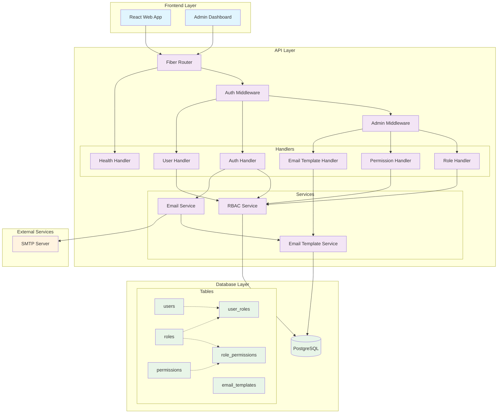

# Studio45 API

A modern, secure API built with Go, Fiber, and PostgreSQL featuring role-based access control (RBAC) and comprehensive user management.

## Features

- **Authentication & Authorization**: JWT-based auth with role-based access control
- **User Management**: Complete user lifecycle with profile management
- **Role-Based Access Control**: Normalized RBAC system with comprehensive CRUD operations
- **Admin Panel**: Full-featured user, role, and permission management UI
- **Permission Management**: Granular permission system with resource-action structure
- **Email Template Management**: Database-driven customizable email templates with preview and testing
- **Password Reset**: Secure email-based password recovery with configurable templates
- **Database Migrations**: Version-controlled schema management
- **API Documentation**: Comprehensive endpoint documentation

## Architecture

- **Framework**: Go with Fiber web framework
- **Database**: PostgreSQL with GORM ORM
- **Authentication**: JWT tokens with middleware protection
- **Email**: Configurable SMTP for notifications with template management
- **Migration**: Custom migration system
- **Validation**: Request validation with go-playground/validator

## Architecture Overview

The Studio45 API follows a layered architecture pattern with clear separation of concerns:



### Component Description

#### Frontend Layer
- **React Web App**: User-facing application with authentication and profile management
- **Admin Dashboard**: Administrative interface for user, role, permission, and email template management

#### API Layer
- **Fiber Router**: HTTP request routing and middleware orchestration
- **Auth Middleware**: JWT token validation and user authentication
- **Admin Middleware**: Role-based access control for admin endpoints
- **Handlers**: HTTP request handlers for different functional areas
- **Services**: Business logic layer with database interactions

#### Database Layer
- **PostgreSQL**: Primary data store with normalized RBAC schema
- **Users**: User accounts and profile information
- **Roles/Permissions**: RBAC system with many-to-many relationships
- **Email Templates**: Configurable email templates with variables

#### Data Flow

1. **Authentication Flow**:
   ```
   Frontend → Auth Handler → RBAC Service → Database
   ```

2. **Admin Operations**:
   ```
   Admin Dashboard → Admin Middleware → Handlers → Services → Database
   ```

3. **Email System**:
   ```
   Auth Handler → Email Service → Email Template Service → SMTP Server
   ```

4. **RBAC Verification**:
   ```
   Middleware → RBAC Service → Database → Permission Check
   ```

## Quick Start

### Prerequisites

- Go 1.19+
- PostgreSQL 13+
- Git

### Installation

1. **Clone the repository**
   ```bash
   git clone <repository-url>
   cd studio45/apps/api
   ```

2. **Install dependencies**
   ```bash
   go mod download
   ```

3. **Set up environment variables**
   ```bash
   cp .env.example .env
   # Edit .env with your configuration
   ```

4. **Run database migrations**
   ```bash
   go run main.go migrate up
   ```

5. **Start the server**
   ```bash
   go run main.go serve
   ```

The API will be available at `http://localhost:8080`

## Configuration

### Environment Variables

| Variable | Description | Default |
|----------|-------------|---------|
| `PORT` | Server port | `8080` |
| `DATABASE_URL` | PostgreSQL connection string | Required |
| `JWT_SECRET` | JWT signing secret | Required |
| `JWT_EXPIRATION` | Token expiration duration | `24h` |
| `SMTP_HOST` | SMTP server hostname | Required for email |
| `SMTP_PORT` | SMTP server port | `587` |
| `SMTP_USERNAME` | SMTP username | Required for email |
| `SMTP_PASSWORD` | SMTP password | Required for email |
| `CORS_ALLOWED_ORIGINS` | CORS allowed origins | `*` |

### Database Setup

1. Create a PostgreSQL database
2. Set the `DATABASE_URL` environment variable
3. Run migrations: `go run main.go migrate up`

## API Documentation

### Authentication Endpoints

| Method | Endpoint | Description | Auth Required |
|--------|----------|-------------|---------------|
| `POST` | `/api/v1/auth/register` | Register new user | No |
| `POST` | `/api/v1/auth/login` | User login | No |
| `POST` | `/api/v1/auth/forgot-password` | Request password reset | No |
| `POST` | `/api/v1/auth/reset-password` | Reset password | No |

### User Endpoints

| Method | Endpoint | Description | Auth Required |
|--------|----------|-------------|---------------|
| `GET` | `/api/v1/protected/profile` | Get user profile | Yes |
| `PUT` | `/api/v1/protected/profile` | Update user profile | Yes |

### Admin Endpoints

#### User Management
| Method | Endpoint | Description | Auth Required |
|--------|----------|-------------|---------------|
| `GET` | `/api/v1/admin/users` | List all users | Admin |
| `POST` | `/api/v1/admin/users` | Create new user | Admin |
| `PUT` | `/api/v1/admin/users/:id` | Update user | Admin |
| `PUT` | `/api/v1/admin/users/:id/roles` | Update user roles | Admin |
| `DELETE` | `/api/v1/admin/users/:id` | Delete user | Admin |
| `GET` | `/api/v1/admin/users/:id/permissions` | Get user permissions | Admin |
| `GET` | `/api/v1/admin/users/:id/permissions/:permission` | Check user permission | Admin |

#### Role Management  
| Method | Endpoint | Description | Auth Required |
|--------|----------|-------------|---------------|
| `GET` | `/api/v1/admin/roles` | List all roles | Admin |
| `POST` | `/api/v1/admin/roles` | Create new role | Admin |
| `GET` | `/api/v1/admin/roles/:id` | Get role by ID with permissions | Admin |
| `PUT` | `/api/v1/admin/roles/:id` | Update role | Admin |
| `DELETE` | `/api/v1/admin/roles/:id` | Delete role | Admin |
| `GET` | `/api/v1/admin/roles/:id/permissions` | Get role permissions | Admin |
| `PUT` | `/api/v1/admin/roles/:id/permissions` | Update role permissions | Admin |

#### Permission Management
| Method | Endpoint | Description | Auth Required |
|--------|----------|-------------|---------------|
| `GET` | `/api/v1/admin/permissions` | List all permissions | Admin |
| `POST` | `/api/v1/admin/permissions` | Create new permission | Admin |
| `GET` | `/api/v1/admin/permissions/:id` | Get permission by ID | Admin |
| `PUT` | `/api/v1/admin/permissions/:id` | Update permission | Admin |
| `DELETE` | `/api/v1/admin/permissions/:id` | Delete permission | Admin |

#### Email Template Management
| Method | Endpoint | Description | Auth Required |
|--------|----------|-------------|---------------|
| `GET` | `/api/v1/admin/email-templates` | List all email templates | Admin |
| `POST` | `/api/v1/admin/email-templates` | Create new email template | Admin |
| `GET` | `/api/v1/admin/email-templates/:id` | Get email template by ID | Admin |
| `PUT` | `/api/v1/admin/email-templates/:id` | Update email template | Admin |
| `DELETE` | `/api/v1/admin/email-templates/:id` | Delete email template | Admin |
| `GET` | `/api/v1/admin/email-templates/:id/variables` | Get template variables | Admin |
| `POST` | `/api/v1/admin/email-templates/:id/preview` | Preview rendered template | Admin |
| `POST` | `/api/v1/admin/email-templates/:id/test` | Send test email | Admin |

### System Endpoints

| Method | Endpoint | Description | Auth Required |
|--------|----------|-------------|---------------|
| `GET` | `/health` | Health check | No |

## Role-Based Access Control (RBAC)

Studio45 implements a comprehensive RBAC system with the following features:

### Default Roles

- **`user`**: Basic user access (default for new registrations)
- **`admin`**: Full system access including user management
- **`moderator`**: Content moderation capabilities
- **`premium`**: Access to premium features

### Key Features

- **Normalized Database**: Separate tables for roles, permissions, and assignments
- **Audit Trail**: Complete tracking of role changes with timestamps and grantor
- **Real-time Updates**: Roles fetched from database on each request
- **Granular Permissions**: Fine-grained control over system access
- **Security**: JWT contains minimal data, roles always current

### Documentation

**[Complete RBAC Documentation](docs/RBAC_SYSTEM.md)**

The comprehensive RBAC guide includes:
- Database architecture and schema
- Migration instructions
- API usage examples
- Frontend integration patterns
- Security considerations
- Troubleshooting guide

## Development

### Running Migrations

```bash
# Check current migration status
go run main.go migrate status

# Apply all pending migrations
go run main.go migrate up

# Rollback last migration
go run main.go migrate down

# Create new migration
go run main.go migrate create migration_name
```

### Project Structure

```
apps/api/
├── cmd/                    # CLI commands
│   ├── main.go            # Main command and server
│   └── migrate.go         # Migration commands
├── docs/                  # Documentation
│   ├── RBAC_SYSTEM.md     # RBAC documentation
│   ├── SMTP_CONFIGURATION.md # Email configuration guide
│   └── EMAIL_TEMPLATES.md # Email template management guide
├── internal/              # Private application code
│   ├── auth/              # Authentication logic
│   ├── database/          # Database connection
│   ├── dto/               # Data transfer objects
│   │   ├── roles.go       # Role DTOs
│   │   ├── permissions.go # Permission DTOs
│   │   ├── users.go       # User DTOs
│   │   └── email_template.go # Email template DTOs
│   ├── handlers/          # HTTP handlers
│   │   ├── auth.go        # Authentication handlers
│   │   ├── admin.go       # User management handlers
│   │   ├── roles.go       # Role management handlers
│   │   ├── permissions.go # Permission management handlers
│   │   ├── email_templates.go # Email template handlers
│   │   └── health.go      # Health check handler
│   ├── helpers/           # Utility functions
│   ├── middleware/        # HTTP middleware
│   ├── migration/         # Migration system
│   ├── models/            # Database models
│   │   ├── user.go        # User model
│   │   ├── role.go        # Role model
│   │   ├── permission.go  # Permission model
│   │   └── email_template.go # Email template model
│   ├── server/            # Server setup and routing
│   └── services/          # Business logic services
│       ├── rbac.service.go # RBAC service
│       ├── email.go       # Email service
│       └── email_template.service.go # Email template service
├── migrations/            # SQL migration files
├── main.go               # Application entry point
├── go.mod                # Go module file
└── README.md             # This file
```

### Adding New Endpoints

1. Define the handler in `internal/handlers/`
2. Add the route in `internal/server/server.go`
3. Apply appropriate middleware for authentication/authorization
4. Add tests and documentation

### Database Models

Models are defined in `internal/models/` using GORM. Key models include:

- **User**: User account information and profile data
- **Role**: Role definitions with descriptions
- **Permission**: Granular permissions with resource-action structure
- **UserRole**: User-role assignments with audit trail
- **RolePermission**: Role-permission assignments
- **EmailTemplate**: Customizable email templates with variables

## Testing

```bash
# Run all tests
go test ./...

# Run tests with coverage
go test -cover ./...

# Run specific package tests
go test ./internal/handlers
```

## Additional Documentation

- **[RBAC System](docs/RBAC_SYSTEM.md)**: Comprehensive guide to role-based access control
- **[SMTP Configuration](docs/SMTP_CONFIGURATION.md)**: Email setup guide
- **[Email Templates](docs/EMAIL_TEMPLATES.md)**: Email template management and customization

## Security Features

- **JWT Authentication**: Secure token-based authentication
- **Password Hashing**: Bcrypt encryption for passwords
- **Rate Limiting**: Built-in protection against abuse
- **CORS Configuration**: Configurable cross-origin requests
- **Input Validation**: Comprehensive request validation
- **SQL Injection Protection**: GORM ORM with prepared statements
- **Role-based Authorization**: Fine-grained access control

## Deployment

### Docker Support

```dockerfile
# Example Dockerfile
FROM golang:1.19-alpine AS builder
WORKDIR /app
COPY . .
RUN go build -o main .

FROM alpine:latest
RUN apk --no-cache add ca-certificates
WORKDIR /root/
COPY --from=builder /app/main .
CMD ["./main", "serve"]
```

### Environment Configuration

For production deployment:

1. Set strong `JWT_SECRET`
2. Configure PostgreSQL with connection pooling
3. Set up SMTP for email notifications
4. Configure CORS for your domain
5. Enable TLS/SSL termination
6. Set up monitoring and logging

## Contributing

1. Fork the repository
2. Create a feature branch (`git checkout -b feature/amazing-feature`)
3. Commit your changes (`git commit -m 'Add some amazing feature'`)
4. Push to the branch (`git push origin feature/amazing-feature`)
5. Open a Pull Request

## License

This project is licensed under the MIT License - see the LICENSE file for details.

## Support

For questions and support:

1. Check the [RBAC Documentation](docs/RBAC_SYSTEM.md)
2. Review existing issues
3. Create a new issue with detailed information

---

**Built with ❤️ by the @ak9024**