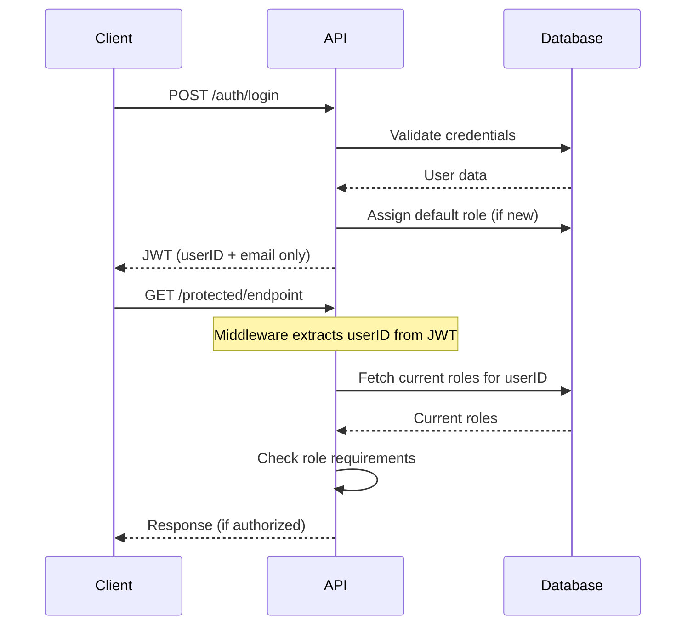

# Role-Based Access Control (RBAC) System Documentation

## Table of Contents
1. [Overview](#overview)
2. [Database Architecture](#database-architecture)
3. [API Endpoints](#api-endpoints)
4. [Authentication Flow](#authentication-flow)
5. [Role Management](#role-management)
6. [Permission System](#permission-system)
7. [Migration Guide](#migration-guide)
8. [Security Considerations](#security-considerations)
9. [API Usage Examples](#api-usage-examples)
10. [Frontend Integration](#frontend-integration)

## Overview

Studio45 implements a normalized Role-Based Access Control (RBAC) system that provides:

- **Scalable Architecture**: Normalized database tables for optimal performance
- **Audit Trail**: Complete tracking of role assignments and changes
- **Granular Permissions**: Fine-grained control over system access
- **Real-time Updates**: Roles fetched from database on each request
- **Security First**: JWT contains minimal data, roles always current

## Database Architecture

### Core Tables

#### `roles`
Stores role definitions and metadata.
```sql
CREATE TABLE roles (
    id UUID PRIMARY KEY DEFAULT uuid_generate_v4(),
    name VARCHAR(50) UNIQUE NOT NULL,
    description TEXT,
    created_at TIMESTAMP WITH TIME ZONE DEFAULT NOW(),
    updated_at TIMESTAMP WITH TIME ZONE DEFAULT NOW()
);
```

#### `permissions`
Defines granular permissions with resource-action structure.
```sql
CREATE TABLE permissions (
    id UUID PRIMARY KEY DEFAULT uuid_generate_v4(),
    name VARCHAR(100) UNIQUE NOT NULL,
    resource VARCHAR(100) NOT NULL,
    action VARCHAR(50) NOT NULL,
    description TEXT,
    created_at TIMESTAMP WITH TIME ZONE DEFAULT NOW(),
    updated_at TIMESTAMP WITH TIME ZONE DEFAULT NOW()
);
```

#### `role_permissions`
Maps permissions to roles (many-to-many).
```sql
CREATE TABLE role_permissions (
    role_id UUID NOT NULL REFERENCES roles(id) ON DELETE CASCADE,
    permission_id UUID NOT NULL REFERENCES permissions(id) ON DELETE CASCADE,
    created_at TIMESTAMP WITH TIME ZONE DEFAULT NOW(),
    PRIMARY KEY (role_id, permission_id)
);
```

#### `user_roles`
Maps users to roles with audit trail.
```sql
CREATE TABLE user_roles (
    user_id UUID NOT NULL REFERENCES users(id) ON DELETE CASCADE,
    role_id UUID NOT NULL REFERENCES roles(id) ON DELETE CASCADE,
    granted_at TIMESTAMP WITH TIME ZONE DEFAULT NOW(),
    granted_by UUID REFERENCES users(id),
    expires_at TIMESTAMP WITH TIME ZONE,
    PRIMARY KEY (user_id, role_id)
);
```

### Default Roles

| Role | Description | Default Permissions |
|------|-------------|-------------------|
| `user` | Basic user access | `profile.read`, `profile.write` |
| `admin` | Full system access | All permissions |
| `moderator` | Content moderation | User and content permissions |
| `premium` | Premium features | User permissions + `premium.access` |

### Default Permissions

| Permission | Resource | Action | Description |
|------------|----------|--------|-------------|
| `profile.read` | profile | read | View own profile |
| `profile.write` | profile | write | Edit own profile |
| `users.read` | users | read | View user profiles |
| `users.write` | users | write | Edit user profiles |
| `users.delete` | users | delete | Delete users |
| `users.roles.manage` | users | roles | Manage user roles |
| `admin.access` | admin | access | Access admin panel |
| `admin.settings` | admin | settings | Manage system settings |
| `content.moderate` | content | moderate | Moderate user content |
| `content.delete` | content | delete | Delete user content |
| `premium.access` | premium | access | Access premium features |

## API Endpoints

### Authentication Endpoints

#### Register User
```http
POST /api/v1/auth/register
Content-Type: application/json

{
  "name": "John Doe",
  "email": "john@example.com",
  "password": "securepassword"
}
```

**Response:**
```json
{
  "token": "eyJhbGciOiJIUzI1NiIs...",
  "user": {
    "id": "uuid",
    "email": "john@example.com",
    "name": "John Doe"
  }
}
```

**Note:** New users automatically receive the "user" role.

#### Login
```http
POST /api/v1/auth/login
Content-Type: application/json

{
  "email": "john@example.com",
  "password": "securepassword"
}
```

#### Get Profile
```http
GET /api/v1/protected/profile
Authorization: Bearer {token}
```

**Response:**
```json
{
  "id": "uuid",
  "email": "john@example.com",
  "name": "John Doe",
  "phone": "+1234567890",
  "company": "Example Corp",
  "roles": ["user", "premium"],
  "created_at": "2024-01-01T12:00:00Z",
  "updated_at": "2024-01-15T14:30:00Z"
}
```

#### Update Profile
```http
PUT /api/v1/protected/profile
Authorization: Bearer {token}
Content-Type: application/json

{
  "name": "John Smith",
  "phone": "+1234567890",
  "company": "New Company"
}
```

**Note:** Roles cannot be updated via profile endpoint. Use admin endpoints instead.

### Admin Endpoints (Requires `admin` role)

#### List All Users
```http
GET /api/v1/admin/users
Authorization: Bearer {admin_token}
```

**Response:**
```json
{
  "users": [
    {
      "id": "uuid",
      "email": "user@example.com",
      "name": "User Name",
      "phone": null,
      "company": null,
      "roles": ["user"],
      "created_at": "2024-01-01T12:00:00Z",
      "updated_at": "2024-01-01T12:00:00Z"
    }
  ],
  "total": 1
}
```

#### Update User Roles
```http
PUT /api/v1/admin/users/{userId}/roles
Authorization: Bearer {admin_token}
Content-Type: application/json

{
  "roles": ["user", "premium"]
}
```

**Response:**
```json
{
  "id": "uuid",
  "email": "user@example.com",
  "name": "User Name",
  "phone": null,
  "company": null,
  "roles": ["user", "premium"],
  "created_at": "2024-01-01T12:00:00Z",
  "updated_at": "2024-01-15T14:30:00Z"
}
```

#### Delete User
```http
DELETE /api/v1/admin/users/{userId}
Authorization: Bearer {admin_token}
```

**Response:**
```json
{
  "message": "User deleted successfully"
}
```

#### Get Available Roles
```http
GET /api/v1/admin/roles
Authorization: Bearer {admin_token}
```

**Response:**
```json
{
  "roles": [
    {
      "id": "uuid",
      "name": "user",
      "description": "Basic user access",
      "created_at": "2024-01-01T12:00:00Z",
      "updated_at": "2024-01-01T12:00:00Z"
    }
  ],
  "total": 4
}
```

#### Create Role
```http
POST /api/v1/admin/roles
Authorization: Bearer {admin_token}
Content-Type: application/json

{
  "name": "moderator",
  "description": "Content moderation capabilities"
}
```

**Response:**
```json
{
  "id": "uuid",
  "name": "moderator",
  "description": "Content moderation capabilities",
  "permissions": [],
  "created_at": "2024-01-01T12:00:00Z",
  "updated_at": "2024-01-01T12:00:00Z"
}
```

#### Get Role by ID
```http
GET /api/v1/admin/roles/{roleId}
Authorization: Bearer {admin_token}
```

**Response:**
```json
{
  "id": "uuid",
  "name": "moderator",
  "description": "Content moderation capabilities",
  "permissions": [
    {
      "id": "uuid",
      "name": "content.moderate",
      "resource": "content",
      "action": "moderate",
      "description": "Moderate user content",
      "created_at": "2024-01-01T12:00:00Z",
      "updated_at": "2024-01-01T12:00:00Z"
    }
  ],
  "created_at": "2024-01-01T12:00:00Z",
  "updated_at": "2024-01-01T12:00:00Z"
}
```

#### Update Role
```http
PUT /api/v1/admin/roles/{roleId}
Authorization: Bearer {admin_token}
Content-Type: application/json

{
  "name": "senior-moderator",
  "description": "Senior content moderation capabilities"
}
```

**Response:**
```json
{
  "id": "uuid",
  "name": "senior-moderator", 
  "description": "Senior content moderation capabilities",
  "permissions": [
    {
      "id": "uuid",
      "name": "content.moderate",
      "resource": "content",
      "action": "moderate",
      "description": "Moderate user content",
      "created_at": "2024-01-01T12:00:00Z",
      "updated_at": "2024-01-01T12:00:00Z"
    }
  ],
  "created_at": "2024-01-01T12:00:00Z",
  "updated_at": "2024-01-15T14:30:00Z"
}
```

#### Delete Role
```http
DELETE /api/v1/admin/roles/{roleId}
Authorization: Bearer {admin_token}
```

**Response:**
```json
{
  "message": "Role deleted successfully"
}
```

**Note:** System roles `admin` and `user` cannot be deleted.

#### Get Role Permissions
```http
GET /api/v1/admin/roles/{roleId}/permissions
Authorization: Bearer {admin_token}
```

**Response:**
```json
{
  "permissions": [
    {
      "id": "uuid",
      "name": "content.moderate",
      "resource": "content",
      "action": "moderate",
      "description": "Moderate user content",
      "created_at": "2024-01-01T12:00:00Z",
      "updated_at": "2024-01-01T12:00:00Z"
    }
  ],
  "total": 1
}
```

#### Update Role Permissions
```http
PUT /api/v1/admin/roles/{roleId}/permissions
Authorization: Bearer {admin_token}
Content-Type: application/json

{
  "permission_ids": ["uuid1", "uuid2", "uuid3"]
}
```

**Response:**
```json
{
  "id": "uuid",
  "name": "moderator",
  "description": "Content moderation capabilities",
  "permissions": [
    {
      "id": "uuid1",
      "name": "content.moderate",
      "resource": "content",
      "action": "moderate",
      "description": "Moderate user content",
      "created_at": "2024-01-01T12:00:00Z",
      "updated_at": "2024-01-01T12:00:00Z"
    }
  ],
  "created_at": "2024-01-01T12:00:00Z",
  "updated_at": "2024-01-15T14:30:00Z"
}
```

#### Get All Permissions
```http
GET /api/v1/admin/permissions
Authorization: Bearer {admin_token}
```

**Response:**
```json
{
  "permissions": [
    {
      "id": "uuid",
      "name": "profile.read",
      "resource": "profile",
      "action": "read",
      "description": "View own profile",
      "created_at": "2024-01-01T12:00:00Z",
      "updated_at": "2024-01-01T12:00:00Z"
    }
  ],
  "total": 11
}
```

#### Create Permission
```http
POST /api/v1/admin/permissions
Authorization: Bearer {admin_token}
Content-Type: application/json

{
  "name": "reports.generate",
  "resource": "reports",
  "action": "generate",
  "description": "Generate system reports"
}
```

**Response:**
```json
{
  "id": "uuid",
  "name": "reports.generate",
  "resource": "reports", 
  "action": "generate",
  "description": "Generate system reports",
  "created_at": "2024-01-01T12:00:00Z",
  "updated_at": "2024-01-01T12:00:00Z"
}
```

#### Get Permission by ID
```http
GET /api/v1/admin/permissions/{permissionId}
Authorization: Bearer {admin_token}
```

**Response:**
```json
{
  "id": "uuid",
  "name": "reports.generate",
  "resource": "reports",
  "action": "generate", 
  "description": "Generate system reports",
  "created_at": "2024-01-01T12:00:00Z",
  "updated_at": "2024-01-01T12:00:00Z"
}
```

#### Update Permission
```http
PUT /api/v1/admin/permissions/{permissionId}
Authorization: Bearer {admin_token}
Content-Type: application/json

{
  "name": "reports.view",
  "resource": "reports",
  "action": "view",
  "description": "View system reports"
}
```

**Response:**
```json
{
  "id": "uuid",
  "name": "reports.view",
  "resource": "reports",
  "action": "view",
  "description": "View system reports",
  "created_at": "2024-01-01T12:00:00Z",
  "updated_at": "2024-01-15T14:30:00Z"
}
```

#### Delete Permission
```http
DELETE /api/v1/admin/permissions/{permissionId}
Authorization: Bearer {admin_token}
```

**Response:**
```json
{
  "message": "Permission deleted successfully"
}
```

#### Get User Permissions
```http
GET /api/v1/admin/users/{userId}/permissions
Authorization: Bearer {admin_token}
```

**Response:**
```json
{
  "permissions": [
    {
      "id": "uuid",
      "name": "profile.read",
      "resource": "profile",
      "action": "read",
      "description": "View own profile"
    }
  ],
  "total": 2
}
```

#### Check User Permission
```http
GET /api/v1/admin/users/{userId}/permissions/{permissionName}
Authorization: Bearer {admin_token}
```

**Response:**
```json
{
  "user_id": "uuid",
  "permission": "admin.access",
  "has_permission": true
}
```

## Authentication Flow



## Role Management

### Middleware Functions

#### `RequireAuth()`
Basic authentication check. Validates JWT and fetches user roles.

```go
protected := v1.Group("/protected")
protected.Use(middleware.RequireAuth())
```

#### `RequireRole(role string)`
Requires a specific role.

```go
admin.Use(middleware.RequireRole("admin"))
```

#### `RequireAnyRole(roles []string)`
Requires any of the specified roles.

```go
moderator.Use(middleware.RequireAnyRole([]string{"admin", "moderator"}))
```

#### `RequireAllRoles(roles []string)`
Requires all of the specified roles.

```go
superuser.Use(middleware.RequireAllRoles([]string{"admin", "premium"}))
```

#### `RequireAdmin()`
Convenience function for admin-only routes.

```go
admin.Use(middleware.RequireAdmin())
```

### Assigning Roles

1. **New User Registration**: Automatically assigned "user" role
2. **Admin Assignment**: Via `/api/v1/admin/users/{id}/roles` endpoint
3. **Audit Trail**: All assignments tracked with grantor and timestamp

### Role Validation

- All role changes validated against existing roles table
- Foreign key constraints prevent invalid role assignments
- Admins cannot remove their own admin role
- Users cannot delete themselves

## Permission System

### Permission Structure

Permissions follow a `resource.action` naming convention:
- `profile.read` - Read profile data
- `users.write` - Modify user data
- `admin.access` - Access admin functionality

### Checking Permissions

Backend service provides methods for permission checking:

```go
rbacService := services.NewRBACService()

// Check single permission
hasPermission, err := rbacService.HasPermission(userID, "users.write")

// Get all user permissions
permissions, err := rbacService.GetUserPermissions(userID)
```

## Migration Guide

### Running Migrations

Execute migrations in the following order:

```bash
# 1. Create RBAC tables and seed data
go run main.go migrate up 1755130087

# 2. Migrate existing array-based roles to normalized tables
go run main.go migrate up 1755130452

# 3. Remove old roles column from users table
go run main.go migrate up 1755130488
```

### Migration Details

1. **Create RBAC Tables** (`1755130087_create_rbac_tables.up.sql`)
   - Creates `roles`, `permissions`, `role_permissions`, `user_roles` tables
   - Seeds default roles and permissions
   - Establishes proper foreign key relationships

2. **Migrate Existing Data** (`1755130452_migrate_existing_roles_to_rbac.up.sql`)
   - Converts array-based roles to normalized relationships
   - Assigns default "user" role to users without roles
   - Promotes first user to admin if no admin exists

3. **Remove Old Column** (`1755130488_remove_roles_column_from_users.up.sql`)
   - Removes `roles` array column from users table
   - Completes transition to normalized structure

### Rollback Support

All migrations include rollback scripts:

```bash
# Rollback specific migration
go run main.go migrate down 1755130488

# Rollback all RBAC changes
go run main.go migrate down 1755130087
```

## Security Considerations

### JWT Token Security
- **Minimal Payload**: Contains only user ID and email
- **No Role Data**: Roles always fetched from database
- **Real-time Updates**: Role changes take effect immediately

### Database Security
- **Foreign Key Constraints**: Prevent invalid role assignments
- **Cascade Deletes**: Clean up orphaned relationships
- **Indexed Queries**: Optimized for performance

### Access Control
- **Principle of Least Privilege**: Default "user" role with minimal permissions
- **Admin Safeguards**: Cannot self-demote or self-delete
- **Audit Trail**: All role changes logged with metadata

### Password Security
- **Bcrypt Hashing**: Industry-standard password encryption
- **Password Reset**: Secure token-based reset flow

## API Usage Examples

### Update User Roles (Admin)
```bash
curl -X PUT http://localhost:8080/api/v1/admin/users/user-uuid/roles \
  -H "Authorization: Bearer admin-jwt-token" \
  -H "Content-Type: application/json" \
  -d '{"roles": ["user", "premium"]}'
```

### Check User Permissions
```bash
curl -X GET http://localhost:8080/api/v1/admin/users/user-uuid/permissions \
  -H "Authorization: Bearer admin-jwt-token"
```

### Get All Users (Admin)
```bash
curl -X GET http://localhost:8080/api/v1/admin/users \
  -H "Authorization: Bearer admin-jwt-token"
```

### Delete User (Admin)
```bash
curl -X DELETE http://localhost:8080/api/v1/admin/users/user-uuid \
  -H "Authorization: Bearer admin-jwt-token"
```

## Frontend Integration

### Role-based Rendering

Use the `RoleGuard` component for conditional rendering:

```tsx
import { RoleGuard } from '../components/RoleGuard';

// Single role requirement
<RoleGuard role="admin">
  <AdminButton />
</RoleGuard>

// Multiple role options
<RoleGuard roles={["admin", "moderator"]}>
  <ModerationTools />
</RoleGuard>

// Require all roles
<RoleGuard roles={["admin", "premium"]} requireAll={true}>
  <PremiumAdminFeature />
</RoleGuard>
```

### Protected Routes

Use role-based route protection:

```tsx
import { AdminRoute } from '../components/AdminRoute';
import { ProtectedRoute } from '../components/ProtectedRoute';

// Admin-only route
<Route path="/admin" element={
  <AdminRoute>
    <AdminDashboard />
  </AdminRoute>
} />

// Role-specific route
<Route path="/moderator" element={
  <ProtectedRoute role="moderator">
    <ModerationPanel />
  </ProtectedRoute>
} />
```

### Auth Context Usage

Access role information in components:

```tsx
import { useAuth } from '../hooks/useAuth';

function MyComponent() {
  const { user, hasRole, hasAnyRole, isAdmin } = useAuth();

  if (isAdmin) {
    return <AdminPanel />;
  }

  if (hasRole('premium')) {
    return <PremiumFeatures />;
  }

  if (hasAnyRole(['moderator', 'admin'])) {
    return <ModerationTools />;
  }

  return <StandardView />;
}
```

### Admin Settings UI Components

The system includes comprehensive UI components for role and permission management:

#### RolesDataTable
Data table component for displaying and managing roles:

```tsx
import { RolesDataTable } from '@/components/settings/RolesDataTable';

<RolesDataTable
  roles={roles}
  loading={rolesLoading}
  onEditRole={handleEditRole}
  onDeleteRole={handleDeleteRole}
  onManagePermissions={handleManagePermissions}
/>
```

**Features:**
- Sortable columns (Name, Description, Created Date)
- Search and filtering capabilities
- Action buttons for edit, delete, and permission management
- Loading states and empty states
- Responsive design with mobile support

#### PermissionsDataTable
Data table component for displaying and managing permissions:

```tsx
import { PermissionsDataTable } from '@/components/settings/PermissionsDataTable';

<PermissionsDataTable
  permissions={permissions}
  loading={permissionsLoading}
  onEditPermission={handleEditPermission}
  onDeletePermission={handleDeletePermission}
/>
```

**Features:**
- Displays permission name, resource, action, and description
- Sortable and filterable columns
- Bulk actions support
- Color-coded resource badges
- Action column with edit/delete buttons

#### RoleFormDialog
Modal dialog for creating and editing roles:

```tsx
import { RoleFormDialog } from '@/components/settings/RoleFormDialog';

<RoleFormDialog
  open={roleDialogOpen}
  onOpenChange={setRoleDialogOpen}
  role={selectedRole} // null for create, role object for edit
  onSuccess={handleRoleSuccess}
/>
```

**Features:**
- Form validation with Zod schema
- Error handling with toast notifications
- Support for both create and edit modes
- Real-time validation feedback
- Accessibility-compliant form controls

#### PermissionFormDialog
Modal dialog for creating and editing permissions:

```tsx
import { PermissionFormDialog } from '@/components/settings/PermissionFormDialog';

<PermissionFormDialog
  open={permissionDialogOpen}
  onOpenChange={setPermissionDialogOpen}
  permission={selectedPermission} // null for create, permission object for edit
  onSuccess={handlePermissionSuccess}
/>
```

**Features:**
- Resource and action field validation
- Auto-generated permission names (resource.action)
- Description field with character limits
- Form persistence during editing
- Error handling and success notifications

#### RolePermissionsDialog
Advanced dialog for managing role-permission assignments:

```tsx
import { RolePermissionsDialog } from '@/components/settings/RolePermissionsDialog';

<RolePermissionsDialog
  open={rolePermissionsDialogOpen}
  onOpenChange={setRolePermissionsDialogOpen}
  role={selectedRole}
  onSuccess={handleRolePermissionsSuccess}
/>
```

**Features:**
- Checkbox-based permission selection
- Search and filter permissions
- Grouped permissions by resource
- Bulk select/deselect operations
- Real-time permission count updates
- System role protection (admin permissions)

### Settings Page Integration

Complete settings page implementation with tabbed interface:

```tsx
import { SettingsPage } from '@/pages/settings/SettingsPage';

function App() {
  return (
    <Routes>
      <Route path="/settings" element={
        <AdminRoute>
          <SettingsPage />
        </AdminRoute>
      } />
    </Routes>
  );
}
```

**Settings Page Features:**
- **Security Tab**: Role and permission management interfaces
- **General Tab**: System configuration options  
- **Database Tab**: Database status and maintenance tools
- **Users Tab**: User management tools (referenced from user management page)

**Security Tab Components:**
- Role management section with data table and CRUD operations
- Permission management section with data table and CRUD operations
- Real-time data loading with refresh buttons
- Toast notifications for all operations
- Error boundary with fallback UI
- Loading states and skeleton screens

### API Service Integration

Frontend services for role and permission management:

```tsx
import { adminService } from '@/services/api';

// Role operations
const roles = await adminService.getRoles();
const role = await adminService.getRole(roleId);
const newRole = await adminService.createRole({ name, description });
const updatedRole = await adminService.updateRole(roleId, updates);
await adminService.deleteRole(roleId);

// Permission operations  
const permissions = await adminService.getPermissions();
const permission = await adminService.getPermission(permissionId);
const newPermission = await adminService.createPermission({ name, resource, action, description });
const updatedPermission = await adminService.updatePermission(permissionId, updates);
await adminService.deletePermission(permissionId);

// Role-Permission operations
await adminService.updateRolePermissions(roleId, { permission_ids: [id1, id2] });
const roleWithPermissions = await adminService.getRoleWithPermissions(roleId);
```

### Error Handling

Comprehensive error handling for role and permission operations:

```tsx
try {
  await adminService.createRole(roleData);
  toast.success('Role created successfully');
} catch (error: any) {
  if (error.status === 409) {
    toast.error('Role name already exists');
  } else if (error.status === 403) {
    toast.error('Insufficient permissions');
  } else {
    toast.error(error.message || 'Failed to create role');
  }
}
```

**Error Scenarios Handled:**
- Duplicate role/permission names (409 Conflict)
- Insufficient permissions (403 Forbidden)
- Invalid input data (400 Bad Request)
- Network connectivity issues
- Server errors (500 Internal Server Error)
- Validation errors with detailed field messages

## Error Handling

### Common Error Responses

```json
// Unauthorized (401)
{
  "message": "Invalid or expired token"
}

// Forbidden (403)
{
  "message": "Access denied: insufficient permissions"
}

// Not Found (404)
{
  "message": "User not found"
}

// Validation Error (400)
{
  "message": "Roles cannot be empty"
}

// Conflict (409)
{
  "message": "Email already exists"
}
```

### Frontend Error Handling

```tsx
try {
  await adminService.updateUserRoles(userId, roles);
} catch (error) {
  if (error instanceof ApiError) {
    if (error.status === 403) {
      setError('You do not have permission to perform this action');
    } else {
      setError(error.message);
    }
  }
}
```

## Performance Considerations

### Database Optimization
- **Indexed Columns**: Primary keys, foreign keys, and common query fields
- **Connection Pooling**: Efficient database connection management
- **Query Optimization**: JOINs optimized for role/permission lookups

### Caching Strategies
- **Role Caching**: Consider implementing Redis cache for frequently accessed roles
- **Permission Caching**: Cache user permissions for session duration
- **JWT Optimization**: Minimal payload reduces token size

## Support and Troubleshooting

### Common Issues

1. **Migration Failures**: Check database permissions and existing data
2. **Role Assignment Errors**: Verify role exists in roles table
3. **Permission Denied**: Check user has required role via admin panel
4. **Token Issues**: Verify JWT secret and expiration settings

### Debugging

Enable debug logging in development:

```env
LOG_LEVEL=debug
```

Check migration status:

```bash
go run main.go migrate status
```

Verify role assignments:

```sql
SELECT u.email, r.name as role_name, ur.granted_at
FROM users u
JOIN user_roles ur ON u.id = ur.user_id
JOIN roles r ON ur.role_id = r.id
WHERE u.email = 'user@example.com';
```

## API Usage Examples

### Role Management Examples

#### Create a new role with permissions
```bash
# 1. Create the role
curl -X POST http://localhost:8080/api/v1/admin/roles \
  -H "Authorization: Bearer admin-jwt-token" \
  -H "Content-Type: application/json" \
  -d '{
    "name": "content-manager", 
    "description": "Content management capabilities"
  }'

# 2. Assign permissions to the role
curl -X PUT http://localhost:8080/api/v1/admin/roles/role-uuid/permissions \
  -H "Authorization: Bearer admin-jwt-token" \
  -H "Content-Type: application/json" \
  -d '{
    "permission_ids": ["perm-uuid-1", "perm-uuid-2"]
  }'
```

#### Update role and manage permissions
```bash
# Update role details
curl -X PUT http://localhost:8080/api/v1/admin/roles/role-uuid \
  -H "Authorization: Bearer admin-jwt-token" \
  -H "Content-Type: application/json" \
  -d '{
    "name": "senior-content-manager",
    "description": "Senior content management with additional privileges"
  }'

# Get role with current permissions
curl -X GET http://localhost:8080/api/v1/admin/roles/role-uuid \
  -H "Authorization: Bearer admin-jwt-token"
```

### Permission Management Examples

#### Create resource-specific permissions
```bash
# Create content permissions
curl -X POST http://localhost:8080/api/v1/admin/permissions \
  -H "Authorization: Bearer admin-jwt-token" \
  -H "Content-Type: application/json" \
  -d '{
    "name": "content.publish",
    "resource": "content",
    "action": "publish", 
    "description": "Publish content to public"
  }'

curl -X POST http://localhost:8080/api/v1/admin/permissions \
  -H "Authorization: Bearer admin-jwt-token" \
  -H "Content-Type: application/json" \
  -d '{
    "name": "content.archive",
    "resource": "content", 
    "action": "archive",
    "description": "Archive old content"
  }'
```

#### Bulk permission management
```bash
# Get all permissions for management
curl -X GET http://localhost:8080/api/v1/admin/permissions \
  -H "Authorization: Bearer admin-jwt-token"

# Update permission details
curl -X PUT http://localhost:8080/api/v1/admin/permissions/perm-uuid \
  -H "Authorization: Bearer admin-jwt-token" \
  -H "Content-Type: application/json" \
  -d '{
    "description": "Enhanced content publishing with approval workflow"
  }'
```

---

**Last Updated**: August 2024  
**Version**: 2.0.0  
**Maintainer**: Studio45 Development Team